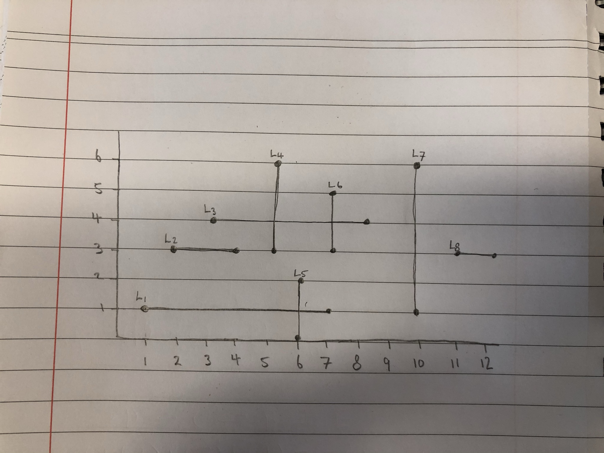

# Q1. Sweep Line Algorithm

### Lines used in the code:

### References:

- I had help understanding the Orthogonal line intersection problem from a [Prinston university lecture on the topic](https://youtu.be/dePDHVovJlE).
- I had a huge help building the Binary Search Tree data structure from [Paul Programming's video series on BST](https://www.youtube.com/watch?v=sf_9w653xdE&list=PLTxllHdfUq4d-DE16EDkpeb8Z68DU7Z_Q).
- I had help with the range search from [Persistent Programmer's video on the topic](https://www.youtube.com/watch?v=iQiEMgbptwQ).
